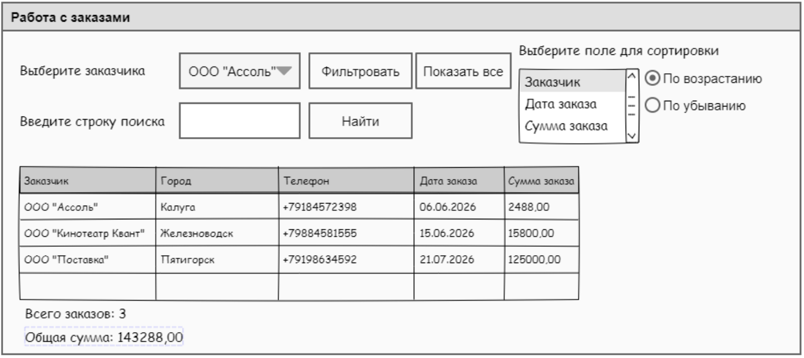

<table style="width: 100%;">
  <tr>
    <td style="text-align: center; border: none;"> 
        Министерство образования и науки РФ  
        ГАПОУ "Зеленодольский механический колледж"
    </td>
  </tr>
  <tr>
    <td style="text-align: center; border: none; height: 45em;">
        <h2>
            Курс занятий по УП 07
        </h2>
    </td>
  </tr>
  <tr>
    <td style="text-align: right; border: none; height: 20em;">
        

            <b>Разработал</b>:  
            Сафиулин Руслан Ринатович
        

    </td>
  </tr>
  <tr>
    <td style="text-align: center; border: none; height: 1em;">
        г.Зеленодольск, 2026
    </td>
  </tr>
</table>

# Содержание

### 

[Руководство по стилю SQL · SQL Style Guide](https://www.sqlstyle.guide/ru/) 
[Учетные данные 235 Группа](docs/235.MD) 
[Учетные данные 237 Группа](docs/237.MD) 
[Оценочные материалы ДЭ 2025 Том 1](OM_DE2025.pdf) 
[Ресурсы для выполнения 2-4 модулей](Resources%20_090207-1-2025.zip)

## 

1. [Общий текст задания](TASK.MD)
2. [Задание 1. Модуль 1,2,3. Разработка, администрирование и защита баз данных](LESSON1.MD)
3. [Задание 1. Модуль 4. Разработка БД](LESSON2.MD)
4. [Задание 2. Модуль 4. Доработка БД и заполнение данными.](LESSON3.MD)
5. [Задание 3. Модуль 2. PostgreSQL. Создание хранимых функций](LESSON4.MD)
6. [Задание 4. Модуль 2. PostgreSQL. Хранимая процедура ADR и триггеры](LESSON5.MD)
7. [Задание 5. Модуль 3. Создание двух запросов](LESSON6.MD)
8. [Задание 6. Модуль 4. Создание JavaFX+PostgreSQL приложения](LESSON7.MD)
9. [Зачетное задание](FINALTASK.MD)

# Задание демонстрационного экзамена

## Общая информация

Участнику демонстрационного экзамена необходимо выполнить совокупность модулей, направленных на проверку профессиональных компетенций в области разработки, администрирования и защиты баз данных, а также разработки модулей программного обеспечения.

Продолжительность выполнения модулей распределена следующим образом:

| Модуль | Вид деятельности / Вид профессиональной деятельности | ГИА ДЭ БУ | ГИА ДЭ ПУ (инвариантная часть) |
|--------|------------------------------------------------------|-----------|--------------------------------|
| 1 | Разработка, администрирование и защита баз данных | 0 ч. 30 мин. | 0 ч. 30 мин. |
| 2 | Разработка, администрирование и защита баз данных | 0 ч. 40 мин. | 0 ч. 40 мин. |
| 3 | Разработка, администрирование и защита баз данных | 0 ч. 20 мин. | 0 ч. 20 мин. |
| 4 | Разработка, администрирование и защита баз данных | — | 0 ч. 30 мин. |
| 5 | Разработка, администрирование и защита баз данных | — | 0 ч. 20 мин. |
| 6 | Соадминистрирование баз данных и серверов | — | 0 ч. 20 мин. |
| 7 | Разработка модулей программного обеспечения для компьютерных систем | — | 1 ч. 00 мин. |
| 8 | Разработка модулей программного обеспечения для компьютерных систем | — | 0 ч. 20 мин. |
| **Максимальная продолжительность** | | **1 ч. 30 мин.** | **4 ч. 00 мин.** |

---

## Модуль 1. Установка и настройка SQL-сервера с автоматическим созданием пользователей и баз данных

Выберите СУБД и среду для управления инфраструктурой.  
Установите ядро выбранной СУБД и среду для управления инфраструктурой SQL (на виртуальную машину или представленный компьютер). При установке задайте имя сервера – «Server_номер вашего рабочего места», например Server_05. У сервера должен быть включен режим смешанной аутентификации.  
Включите или создайте пользователя sa, установив пароль «De_номер вашего рабочего места», например De_05.  

Напишите скрипт, который позволит автоматически:
- создать 10 пользователей user1, user2, user3, …, user10, у которых пароль формируется случайным образом и содержит 5 символов (буквы, цифры);
- базы данных BD1, BD2, BD3, …, BD10;
- настроить права доступа пользователей к базам данных. Пользователь user1 имеет доступ только к базе данных BD1, user2 имеет доступ только к базе данных BD2 и т. д.;
- создать базу данных BD и таблицу Users для хранения пользователей и их паролей;
- заполнить таблицу Users данными о созданных пользователях и паролях.

Необходимые приложения: отсутствуют.

---

## Модуль 2. Шифрование паролей

Хранение паролей в зашифрованном виде очень важно для безопасности доступа к серверу, поэтому создайте скрипт, который зашифрует все пароли в таблице Users.  
Чтобы предотвратить утрату доступа к аккаунту и потерю данных, создайте скрипт, который позволит отобразить данные из таблицы Users с расшифрованными паролями.

Необходимые приложения: отсутствуют.

---

## Модуль 3. Проведение резервного копирования и восстановление базы данных

Напишите скрипт, который позволит провести резервное копирование базы данных BD. Необходимо предоставить скрипт и файл бэкапа.  
Напишите скрипт, который позволит провести процедуру восстановления базы данных.

Необходимые приложения: отсутствуют.

---

## Модуль 4. Проектирование и реализация базы данных на основе ER-диаграммы

На основании документов, представленных заказчиком, необходимо спроектировать ER-диаграмму для информационной системы. Предприятие производит продукцию согласно установленным спецификациям и реализует готовую продукцию заказчикам. Каждая продукция имеет свою цену, зависящую от стоимости материалов.

Обязательна 3 нормальная форма с обеспечением ссылочной целостности. При разработке диаграммы обратите внимание на согласованную осмысленную схему именования, создайте необходимые первичные и внешние ключи. ER-диаграмма должна быть представлена в формате .pdf и содержать таблицы, связи между ними, атрибуты и ключи (типами данных на данном этапе можно пренебречь).

Заполните созданные таблицы начальными тестовыми данными (не менее трёх записей в каждую таблицу).  
*Внимание! Данные из ресурсов импортировать не нужно.*

Необходимые приложения:  

[Прил_ОЗ_КОД 09.02.07-1-2026-М4.rar](Прил_ОЗ_КОД%2009.02.07-1-2026-М4.rar)

---

## Модуль 5. Создание процедуры и триггера

Создайте процедуру, позволяющую вывести общее количество заказов, общее количество заказанной продукции, общую сумму заказов и заказчика за определённый период. Необходимо учесть, что Дата начала периода и Дата конца периода вводятся с клавиатуры или передаются в запрос в виде параметров.

Создайте триггер, автоматически рассчитывающий итоговую сумму заказа покупателя после его оформления. Итоговая сумма должна учитывать:
- общее количество заказанной продукции;
- себестоимость каждой продукции, включающую расход материала согласно установленной норме.

Необходимые приложения: отсутствуют.

---

## Модуль 6. Написание запросов к базе данных

Создайте архивную таблицу с названием, содержащим префикс месяца (например, Order_may). Напишите запрос для переноса данных из основной таблицы «Заказ покупателей» в новую архивную таблицу (переносятся только записи, соответствующие указанному месяцу). После успешного копирования удалите перенесённые строки из исходной таблицы «Заказ покупателей».  
Результат предоставьте в виде скрипта.

Необходимые приложения: отсутствуют.

---

## Модуль 7. Разработка модулей программного обеспечения

Создайте модуль программного обеспечения, который позволит анализировать информацию из созданной базы данных.  

Макет окна представлен на рисунке (прилагается в отдельном файле).  

Подключите к приложению созданную базу данных и реализуйте следующий функционал:
- **Сортировку данных по выбранному полю.** Пользователь выбирает поле для сортировки, после включения переключателя варианта сортировки должна происходить сортировка данных в таблице.
- **Фильтрацию записей в таблице по клиенту.** Пользователь выбирает из списка клиента и по нажатию кнопки «Фильтровать» должна происходить фильтрация данных в таблице, т. е. отображаться заказы выбранного клиента. По нажатию на кнопку «Показать все» отменяется фильтрация записей.
- **Поиск данных.** Пользователь вводит строку поиска и по нажатию кнопки «Найти» должны выделяться цветом ячейки, в которых нашлось совпадение со строкой поиска.
- Для каждой выборки должно отображаться общее количество заказов и общая сумма заказов.

При разработке модуля соблюдайте требования к разработке. Используйте отладку и обрабатывайте исключительные ситуации, чтобы избежать фатальных ошибок при работе приложения. Ваше приложение не должно завершаться аварийно.

Необходимые приложения:  

---

## Модуль 8. Разработка руководства пользователя

Разработайте руководство пользователя для разработанного модуля программного обеспечения. Опишите последовательность действий для выполнения всех функций модуля с использованием скриншотов.

Необходимые приложения: отсутствуют.
