# 📚 Навигация по занятию

| Предыдущее занятие |                     | Следующее занятие |
|:------------------:|:-------------------:|:-----------------:|
| [Задание 3](TASK3.MD) | [Содержание](README.MD) | [Задание 5](TASK5.MD) |

---

# 🐘 PostgreSQL. Создание хранимых функций

> **Краткое содержание:** в этом уроке мы изучим, как использовать конструкцию `CREATE FUNCTION` для добавления пользовательских функций (user-defined functions).

---

## 📖 Введение в оператор создания функции

Оператор `CREATE FUNCTION` позволяет определить новую пользовательскую функцию.

### Синтаксис

```sql
CREATE [OR REPLACE] FUNCTION function_name(param_list)
   RETURNS return_type
   LANGUAGE plpgsql
AS
$$
DECLARE
   -- объявление переменных
BEGIN
   -- логика функции
END;
$$;
```

### Разбор синтаксиса

| Элемент | Описание |
|:--------|:---------|
| `CREATE [OR REPLACE] FUNCTION` | Указывается имя функции. Опция `OR REPLACE` заменяет существующую функцию |
| `param_list` | Параметры функции (можно указать типы). Функция может не иметь параметров |
| `RETURNS` | Тип данных возвращаемого значения |
| `LANGUAGE plpgsql` | Процедурный язык функции (PostgreSQL поддерживает множество языков) |
| `$$ ... $$` | Тело функции помещается в строковую константу (долларовые кавычки) |

---

## 📝 Пример создания функции

Рассмотрим таблицу `room_categories` из нашей базы данных:

| Изображение | Описание |
|:-----------:|:---------|
| 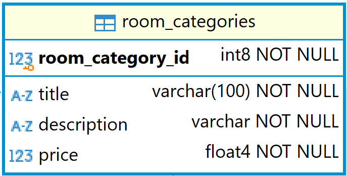 | Структура таблицы |
| 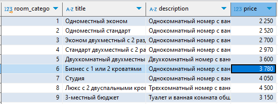 | Пример данных |

### Функция подсчёта категорий по диапазону цен

Функция подсчитывает количество категорий комнат, стоимость которых находится в заданном диапазоне.

```sql
CREATE FUNCTION get_room_categories_count(price_from float4, price_to float4)
RETURNS int
LANGUAGE plpgsql
AS
$$
DECLARE
   room_categories_count integer;
BEGIN
   SELECT count(*)
   INTO room_categories_count
   FROM room_categories
   WHERE price BETWEEN price_from AND price_to;
   RETURN room_categories_count;
END;
$$;
```

### Структура функции

| Раздел | Элемент | Значение |
|:-------|:--------|:---------|
| **Заголовок** | Имя функции | `get_room_categories_count` |
| | Параметры | `price_from` (float4), `price_to` (float4) |
| | Возвращаемый тип | `int` |
| | Язык | `plpgsql` |
| **Тело** | Переменная | `room_categories_count` (integer) |
| | Логика | `SELECT INTO` для подсчёта записей в диапазоне |
| | Возврат | `RETURN room_categories_count` |

---

## 🛠️ Создание функции в DBeaver

### Пошаговая инструкция

| Шаг | Действие | Изображение |
|:---:|:---------|:-----------:|
| 1 | Запустите DBeaver и подключитесь к своей БД | — |
| 2 | Нажмите правой кнопкой по названию БД | — |
| 3 | Выберите **Редактор SQL → Новый редактор SQL** | 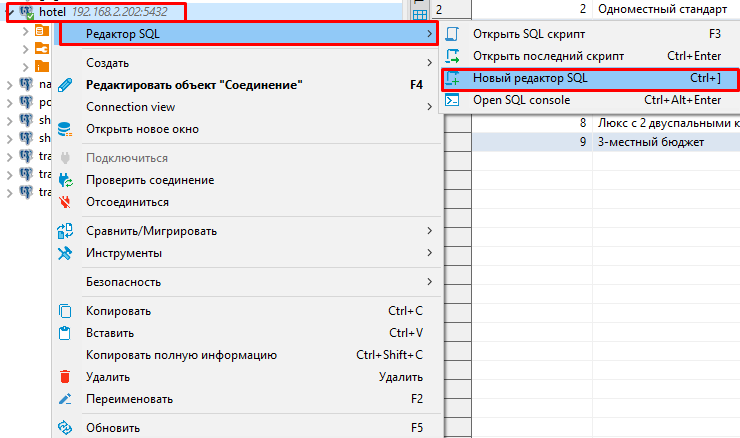 |
| 4 | Скопируйте и вставьте код функции в редактор |  |
| 5 | Нажмите кнопку **Выполнить SQL-запрос** | 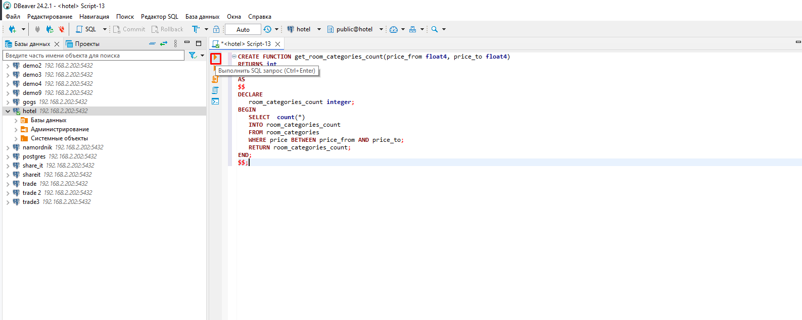 |
| 6 | При успешном создании отобразится результат | 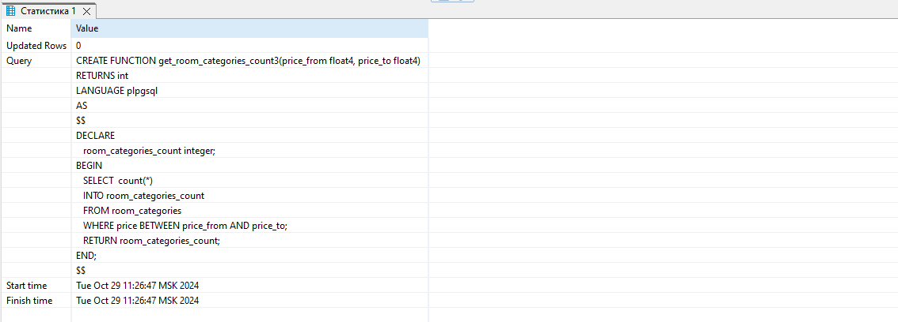 |
| 7 | Найдите функцию в списке функций вашей схемы БД | 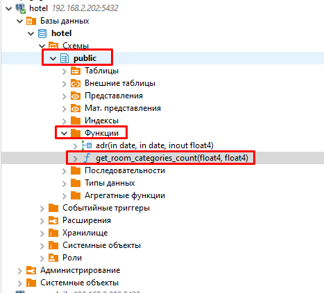 |
| 8 | Если функция не отображается, обновите список: правой кнопкой по папке **Функции** → **Обновить** | 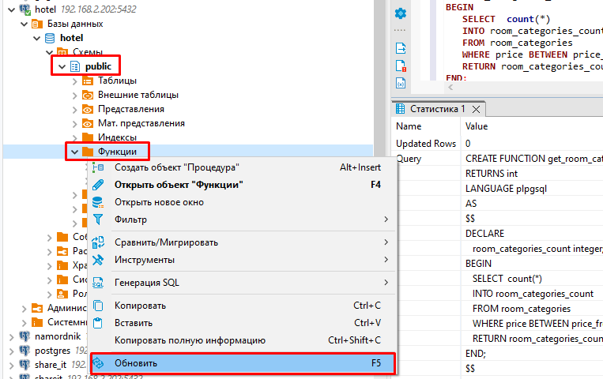 |

---

## 📞 Вызов пользовательских функций

### Способы передачи параметров

PostgreSQL поддерживает три способа передачи параметров в функцию:

| Способ | Описание |
|:-------|:---------|
| **Позиционная нотация** | Аргументы в том же порядке, что и в объявлении функции |
| **Именованная нотация** | Аргументы сопоставляются с параметрами по имени (любой порядок) |
| **Смешанная нотация** | Комбинация позиционной и именованной (позиционные — первые) |

> 💡 **Совет:** Именованная нотация особенно полезна для функций с большим количеством параметров, так как делает связи между параметрами и аргументами более явными.

> ⚠️ **Важно:** Параметры со значениями по умолчанию можно опускать. В позиционной нотации опускать можно только справа налево. В именованной — любую комбинацию.

### Примеры вызовов

#### 📍 Позиционная нотация

```sql
SELECT get_room_categories_count(2000, 3000);
```

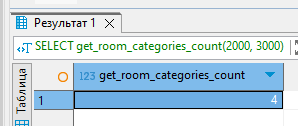

#### 📍 Именованная нотация

```sql
-- используя :=
SELECT get_room_categories_count(price_to := 3000, price_from := 2000);

-- используя =>
SELECT get_room_categories_count(price_to => 3000, price_from => 2000);
```

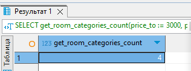

#### 📍 Смешанная нотация

```sql
SELECT get_room_categories_count(1500, price_to => 2300);
```

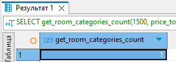

> ⚠️ **Ошибка:** Нельзя использовать именованные аргументы перед позиционными!

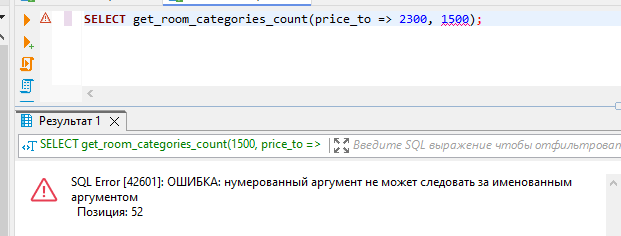

---

## 🔐 Учётные данные групп

| Группа | Ссылка |
|:------:|:------:|
| **215 группа** | [Учётные данные 235 группы](docs/235.MD) |
| **217 группа** | [Учётные данные 237 группы](docs/237.MD) |

---

## 📝 Задания

### Задание 1. Функция-пример

Создайте функцию `get_room_categories_count` согласно примеру и протестируйте её.

### Задание 2. Изучение теории

Изучите дополнительную информацию о входных и выходных параметрах из [статьи](https://neon.tech/postgresql/postgresql-plpgsql/plpgsql-function-parameters).

### Задание 3. Создание хранимых функций

Создайте следующие функции:

| № | Функция | Описание |
|:-:|:--------|:---------|
| 1 | `get_customers_count_born_after` | Возвращает количество клиентов, родившихся **не ранее** заданной даты |
| 2 | `get_customers_count_born_before` | Возвращает количество клиентов, родившихся **не позднее** заданной даты |
| 3 | `get_customers_count_born_between` | Возвращает количество клиентов с датой рождения в пределах заданного диапазона |
| 4 | `get_most_expensive_service` | Возвращает стоимость и название **самой дорогой** дополнительной услуги |
| 5 | `get_cheapest_service` | Возвращает стоимость и название **самой дешевой** дополнительной услуги |
| 6 | `get_most_expensive_room_category` | Возвращает стоимость и название **самой дорогой** категории номера |
| 7 | `get_cheapest_room_category` | Возвращает стоимость и название **самой дешевой** категории номера |

---

## 📤 Сдача работы

Отправьте скрипты созданных функций в репозиторий на **Gogs-сервере**.

| Параметр | Значение |
|:---------|:---------|
| **Имя репозитория** | `UP04_TASK4` |
| **Сервер** | `192.168.2.202:3000` |

---

## 🎯 Критерии оценивания

| Оценка | Требования |
|:------:|:-----------|
| **5 (отлично)** | ✅ Создана функция `get_room_categories_count`<br>✅ Созданы **все 7** требуемых функций |
| **4 (хорошо)** | ✅ Создана функция `get_room_categories_count`<br>✅ Созданы **любые 5** из 7 требуемых функций |
| **3 (удовлетворительно)** | ✅ Создана функция `get_room_categories_count`<br>✅ Созданы **любые 3** из 7 требуемых функций |

---

## 🔗 Полезные ссылки

- [Задание 3](TASK3.MD)
- [Содержание курса](README.MD)
- [Задание 5](TASK5.MD)
- [Статья о параметрах функций](https://neon.tech/postgresql/postgresql-plpgsql/plpgsql-function-parameters)
- [Учётные данные 235 группы](docs/235.MD)
- [Учётные данные 237 группы](docs/237.MD)
